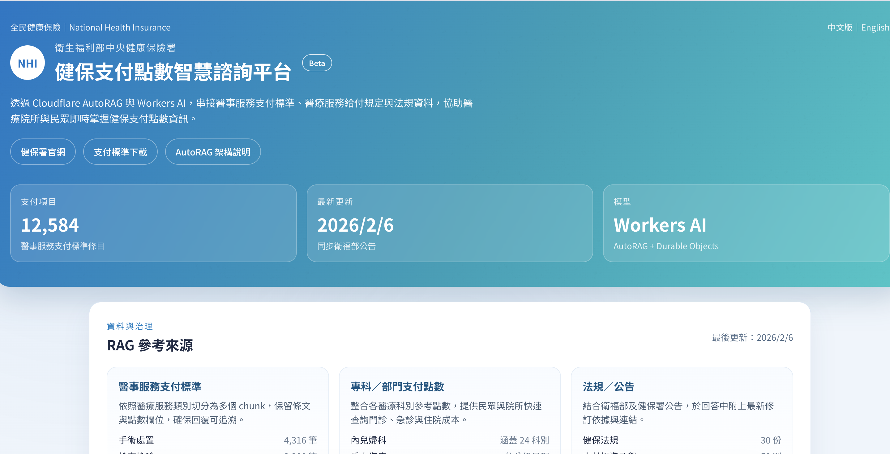
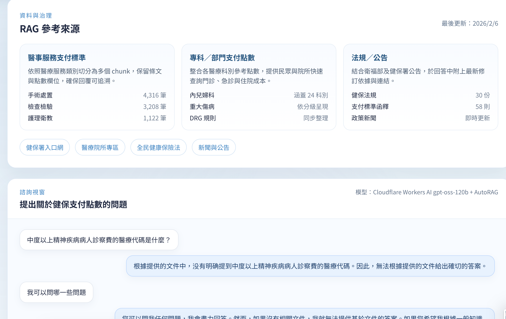
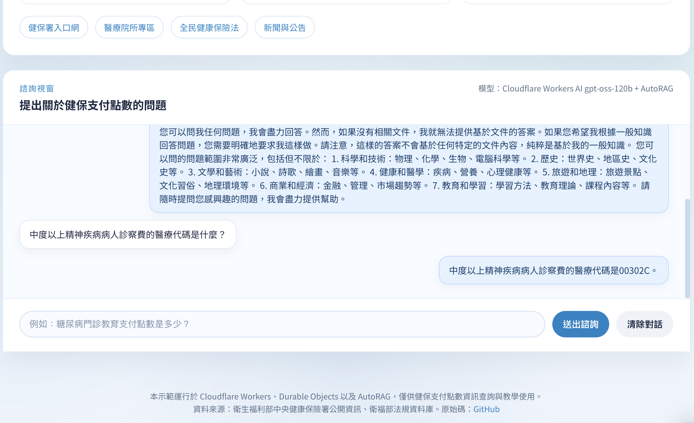

- NHI Medical Payment Chat Bot

## Featured Content

### NHI Medical Payment Stadards in the Bot




Users can engage with the chatbot to retrieve specific disease codes and corresponding payment amounts simply by querying disease names.

## Tech Stack (Cloudflare products)

| Product | Purpose | Documentation |
|---------|---------|---------------|
| **Cloudflare Workers** | Serverless backend & API | [Docs](https://developers.cloudflare.com/workers/) |
| **Durable Objects** | Stateful chat session management | [Docs](https://developers.cloudflare.com/durable-objects/) |
| **R2 Storage** | Object storage for transcript & article | [Docs](https://developers.cloudflare.com/r2/) |
| **Workers AI** | AI inference w/ openai gpt-oss-120b | [Docs](https://developers.cloudflare.com/workers-ai/) |
| **AutoRAG** | Retrieval Augmented Generation | [Docs](https://developers.cloudflare.com/autorag/) |

### Frontend

- React 18
- Emotion/Styled for CSS-in-JS
- esbuild for bundling
- TypeScript

### AI Model

- [OpenAI OSS 120B on Cloudflare Workers AI](https://developers.cloudflare.com/workers-ai/models/gpt-oss-120b/) (`@cf/openai/gpt-oss-120b`)

### Prereqs

- Node.js 18+ and npm
- Cloudflare account with Workers plan
- Wrangler CLI installed globally

```bash
npm install -g wrangler
```

#### Installation
0. Clone and install dependencies:
```bash
git clone https://github.com/hcyuser/nhi-rag-bot
cd nhi-rag-bot
npm install
npm install --save-dev esbuild @types/react @types/react-dom
```

1. Configure wrangler.jsonc (see mine)

2. Auth with Cloudflare/login 
```bash
wrangler login
```
3. [Get the docs](./rag_files)

4. Set up R2 bucket with scraped GQ article and New Heights transcript from the previous step.
```bash
wrangler r2 bucket create med-pay-std
wrangler r2 object put med-pay-std/medical_service_payment_standards.md --file ./path/to/medical_service_payment_standards.md
wrangler r2 object put med-pay-std/medical_service_payment_standards.pdf --file ./path/to/medical_service_payment_standards.pdf
```

5. Configure AutoRAG in your Cloudflare dashboard under AI
Point to your med-pay-std R2 bucket

6. Build and deploy:
```bash
npm run build
wrangler publish
```